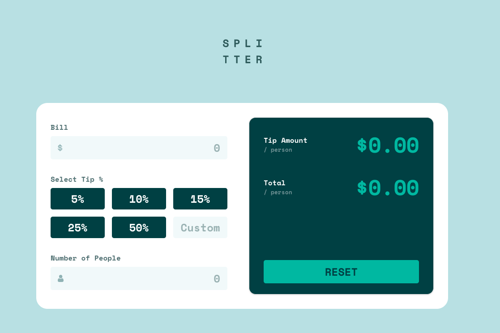

# Frontend Mentor - Tip calculator app solution

This is a solution to the [Tip calculator app challenge on Frontend Mentor](https://www.frontendmentor.io/challenges/tip-calculator-app-ugJNGbJUX). Frontend Mentor challenges help you improve your coding skills by building realistic projects.

## Table of contents

- [Frontend Mentor - Tip calculator app solution](#frontend-mentor---tip-calculator-app-solution)
  - [Table of contents](#table-of-contents)
  - [Overview](#overview)
    - [The challenge](#the-challenge)
    - [Screenshot](#screenshot)
    - [Links](#links)
  - [My process](#my-process)
    - [Tech Stack](#tech-stack)
  - [Author](#author)

## Overview

### The challenge

Users should be able to:

- View the optimal layout for the app depending on their device's screen size
- See hover states for all interactive elements on the page
- Calculate the correct tip and total cost of the bill per person

### Screenshot

### Links

- Solution URL: [Frontend Mentor Solution](https://www.frontendmentor.io/challenges/tip-calculator-app-ugJNGbJUX)
- Live Site URL: [Deployed on Vercel](https://fm-timp-calculator-app.vercel.app/)

## My process

### Tech Stack

- [Next.js](https://nextjs.org/) - React framework
- [React](https://reactjs.org/) - JS library
- [tailwindcss](https://tailwindcss.com/) - utility-first CSS framework
- [node.js](https://nodejs.org/ja) - Runtime & Build Tools
- [shadcn/ui](https://ui.shadcn.com/) - A component collection built on Radix and Tailwind
- [zod](https://zod.dev/) - A TypeScript-first schema validation library
- [class-variance-authority (cva)](https://cva.style/docs) - A library for conditionally managing Tailwind utility classes

## Author

- GitHub - [BlonoBuccellati](https://github.com/BlonoBuccellati)
- Frontend Mentor - [@BlonoBuccellati](https://www.frontendmentor.io/profile/BlonoBuccellati)
- zenn - [@bln](https://zenn.dev/bln)
